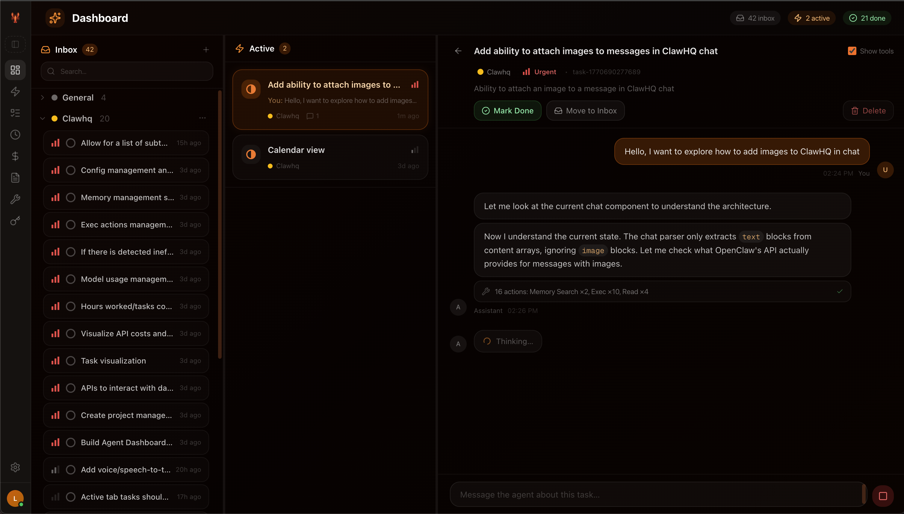
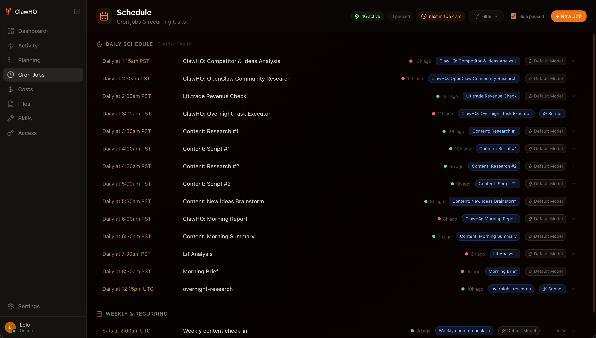

# 🦞 ClawHQ

I wanted to create a better experience for my [OpenClaw](https://github.com/openclaw/openclaw) agents. Focused on helping people better interact with and manage their agents.


## What is this?

ClawHQ is an open-source OpenClaw plugin that adds a web dashboard to your gateway. It's built for **agent owners** — the humans who delegate work to AI agents and need visibility into what's happening.

No separate server. No extra dependencies. Install the plugin and your gateway serves the dashboard.

## Screenshots


*Planning queue with task conversations — delegate work to your agent per-task*


*Daily schedule overview with status indicators and model assignments*

## Features

- **💬 Task Chat** — Every task gets its own chat thread with your agent. Delegate work, track progress, and keep context organized per task
- **📋 Planning Queue** — Task inbox with priorities, projects, and status tracking
- **📡 Activity Feed** — Real-time session activity across all your agents
- **📊 Cost Tracking** — Daily spend, per-model breakdown, usage trends
- **⏰ Cron Manager** — View scheduled jobs, run history, enable/disable
- **🔧 Skills Browser** — See installed skills, eligibility status, and documentation
- **🔑 Access Overview** — Connected channels, API keys, nodes at a glance
- **📁 Files** — Browse and view your agent's workspace files

## 💻 Installation

### Option 1: From npm (recommended)

```bash
openclaw plugins install clawhq
```

Then restart your gateway:

```bash
openclaw gateway restart
```

### Option 2: From source

```bash
git clone https://github.com/blbst123/clawhq.git
cd clawhq
npm install
npm run build
```

Then symlink or copy to your OpenClaw extensions directory:

```bash
mkdir -p ~/.openclaw/workspace/.openclaw/extensions/clawhq
cp index.ts openclaw.plugin.json ~/.openclaw/workspace/.openclaw/extensions/clawhq/
cp -r ui ~/.openclaw/workspace/.openclaw/extensions/clawhq/
openclaw gateway restart
```

## 📊 Accessing the Dashboard

Once installed, open your browser:

```
http://localhost:18789/clawhq/
```

> Replace `18789` with your gateway port if you changed it.

On first visit, you'll need to enter your **gateway auth token**. Find it in:

```bash
cat ~/.openclaw/openclaw.json | grep -A2 '"auth"'
```

The token is stored in your browser's localStorage — it never leaves your machine.

**Tip:** You can also use a one-click URL: `http://localhost:18789/clawhq/?token=YOUR_TOKEN`

## 📚 Using the Task System

ClawHQ includes a planning/task system. Your agent can capture tasks and you can manage them from the dashboard. To enable this, tell your agent:

> "When I ask you to do something that isn't immediate, capture it as a task in ClawHQ. Use the `clawhq.tasks.read` and `clawhq.tasks.write` RPC methods to manage tasks stored in `data/clawhq/tasks.json`."

Or add this to your `AGENTS.md`:

```markdown
## Task Capture
When work comes up that isn't immediate, save it as a task:
- Write tasks to `data/clawhq/tasks.json` via `clawhq.tasks.write` RPC
- Read existing tasks via `clawhq.tasks.read` RPC  
- Each task has: id, title, priority (urgent/medium/low/none), project, status, notes
- Tasks appear in the ClawHQ Planning page for review and prioritization
```

### Task Structure

Tasks are stored as JSON in your workspace at `data/clawhq/tasks.json`:

```json
{
  "cap_abc123": {
    "id": "cap_abc123",
    "title": "Redesign the landing page",
    "priority": "medium",
    "project": "website",
    "status": "todo",
    "notes": "Focus on mobile-first layout",
    "createdAt": "2026-02-10T12:00:00Z"
  }
}
```

## Configuration

The plugin accepts optional config in `openclaw.plugin.json`:

| Option | Default | Description |
|--------|---------|-------------|
| `basePath` | `/clawhq` | URL path prefix for the dashboard |

## Tech Stack

- **UI:** Next.js 16 (static export) + Tailwind CSS 4
- **Backend:** OpenClaw plugin (TypeScript) — HTTP routes + RPC methods
- **Connection:** WebSocket to gateway for real-time data
- **Data:** JSON files in your workspace (`data/clawhq/`)

## Development

```bash
npm install
npm run dev
```

The dev server runs at `http://localhost:3000`. You'll need a running OpenClaw gateway to connect to.

To build the production UI:

```bash
npm run build
```

This compiles Next.js and copies the static export to `ui/`.

## Contributing

PRs welcome. The codebase is a Next.js app with an OpenClaw plugin entry point (`index.ts`).

Key files:
- `index.ts` — Plugin: HTTP routes, RPC methods, file serving
- `src/app/page.tsx` — Dashboard (main page)
- `src/app/planning/page.tsx` — Task planning board
- `src/lib/gateway-rpc.ts` — WebSocket RPC client

## License

MIT

---

Built by [Bill](https://github.com/blbst123) & Lolo 🦞
